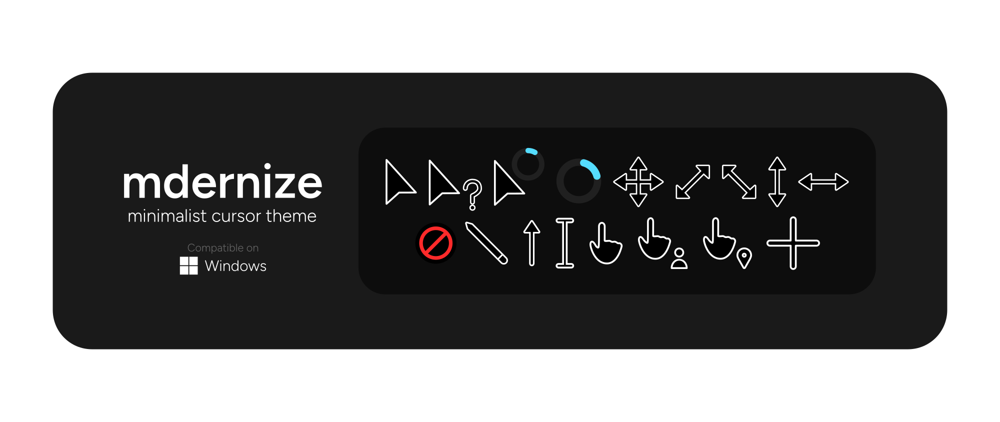
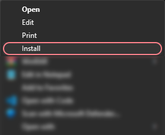

# mdernize

A minimalist cursor theme for Windows. Usability over looks.

Tested only on a 14" 1366x768 HD screen, so might be small on higher resolution (?).

## Installation

- Head over to the [Releases](https://www.github.com/user8595/mdernize/releases/latest) section and download the latest version.

- Extract the .zip file

- Right click the `install.inf` file then select "Install".

## Miscellaneous Info

- [Inkscape](https://inkscape.org) for SVG assets
- [RealWorld Cursor Editor](http://rw-designer.com/cursor-maker) for converting SVG images into .cur files
- Source for `install.inf` file unknown as i forgot about it.

## TODO

- Make all cursors high quality (128px)
- Readjust precise cursor and text insert cursors
- Add light mode

## License

Licensed under the [MIT License](./LICENSE).