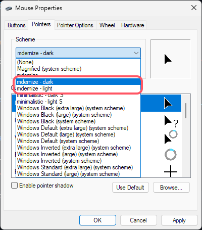

Minimalist cursor theme for Windows. Usability over looks.

Tested only on a 14" 1366x768 HD screen, so might be small on higher resolutions.

## Installation

- Head over to the [Releases](https://www.github.com/user8595/mdernize/releases/latest) section and download the latest version.

- Extract the .zip file.

- Open the folder of each variant (dark & light)

- Then right click the `install.inf` file, and select "Install", as the image below:

- Open the Mouse Properties setting in Control Panel, then select the installed cursor theme, which should look like this:

- You can test the cursor theme using the webpage (`cursor-test.html`) bundled in the `mdernize.zip` file.

## Miscellaneous Info

- [Inkscape](https://inkscape.org) for SVG assets
- [RealWorld Cursor Editor](http://rw-designer.com/cursor-maker) for converting exported PNG images from SVG assets into .cur files
- Source for `install.inf` file unknown as i forgot about it.

## TODO

-~-

## License

Licensed under the [MIT License](./LICENSE.md).